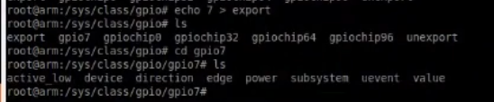

# Roseline Project: Debugging Device Tree Overlays

We demonstrate some debugging techniques while enabling PWM on the Roseline linux kernel.

# Executive Summary

Mar 2017

I couldn't get PWM working on the Linux kernel used by our Roseline project (UCLA Roseline kernel, Linux kernel version 4.1.12). Anh Luong from Univ of Utah helped me debug it. It amounted to a number of configuration bugs.

There were three main problems:

1. We couldn't load our DTO because HDMI was claiming pin `P8_34`. 
    - To reproduce:
        - `capes bone_pwm_P8_34` produces error in `dmesg` log
        - Derek's table: `P8_34` is pin 51
        - Print out pin info: `/sys/kernel/debug/pinctrl/44e10800.pinmux/pins`, see `HDMI CLAIMED` for pin 51.
    - Fixed by switching to an unclaimed pin `P9_16`, which supports PWM peripheral PWM1B.
        - Modify `bone_pwm_P8_34.dts` with different hex numbers to use `P9_16`.
2. After successfully loading the DTO, it still didn't produce a sysfs entry with a file to let us change duty cycle. 
    - `find /sys/ -iname "*duty*"` empty
    - `find /sys/ -iname "*pwm*"` no useful results
    - This was because of a bug in our `bone_pwm_P8_34` DTO, which was missing a clause to enable another PWM-related peripheral `epwmss1`.
    - Decompiled AM33XX_PWM DTO to see how it's "supposed" to work.
        - Saw it enabled both `ehrpwm1` but also `epwmss1`.
    - Added clauses to `bone_pwm_P8_34` to enable the extra PWM peripheral `epwmss1`.
3. After enabling the extra PWM peripheral, it still didn't produce a duty-cycle sysfs entry. 
    - This was because the `bone-pwm-helper` linux kernel module seems to have a bug / feature that it doesn't expose much PWM functionality in a sysfs entry. 
    - Instead used the LKM `pwm_test`:
        - In `bone_pwm_P8_34.dts`, replaced `compatible="bone-pinmux-helper"` with `compatible="pwm_test"`. 
    - Wasn't sure this would work because our Roseline kernel doesn't seem to include the LKM `pwm_test`:
        - `modinfo pwm_test` returns empty.

This file is a summary of my video-chat with Anh as we debugged the problem, which lives here:
    
- `/Users/justin/Dropbox/DC_motor/Anh-helps-roseline-device-tree/`
    - `anh-helps-good-aud-cropped.mov`
    - `anh-helps2-good-aud-cropped.mov`

Some context:

# Minimum-Working-Example of the Problem

Email I sent to Anh asking for help:

- `/Users/justin/Desktop/anh-helps-roseline-beaglebone-device-tree/code/integration-test.zip.asc`
- <https://mail.google.com/mail/u/0/#search/luong%40eng.utah.edu/15b1ba237ae00b66>
- `/Users/justin/Dropbox/DC_motor/Anh-helps-roseline-device-tree/`

Hi Anh,

Thanks for chatting with me today about device-tree stuff. I've attached a zipfile of our integration effort.

Gmail won't let me send a zipfile with exe files, so I encrypted it with gpg with the passphrase 'roseline'.

The zipfile contains:

- overlays/ : all our DTOs.
- pid/ :  my PID controller that drives a DC motor using PWM, QEP, and GPIO.
- time_sync/ : example of QoT / PRU time synchronization
- pru-sets-pwm/ : the PRU configures the PWM and sets it to a 10% duty-cycle at 30kHz on pin P8_34. (doesn't work!)

You should run the script run.sh. It builds everything --- including compiling the .dts files, putting them in /lib/firmware, and 'make'ing all the PRU and C code. Then it runs the program pru-sets-pwm/pru-set-pwm.

The script config-pins.sh uses 'config-pin' to configure various pins for our intended operation, e.g., pin P8_34 should be in mode 2 (PWM). You do not need to call it, since run.sh calls it.

As we discussed, the current problem is that the program ./pru-sets-pwm/pru-set-pwm does not work: The PRU doesn't set a PWM on P8_34.

I'm very grateful for any insights you have on this!

Best,
Justin

# Troubleshooting with Anh

## Try to build & load a PWM DTO
Here is a "device tree overlay" source file named `integration-test/overlays/bone_pwm_P8_34-00A0.dts` that we will try to build and load:

First we compile it and move it to `/lib/firmware` (where the BBB looks for compiled DTOs), like this:

Then we check to see which DTOs are already loaded, with the `capes` cmd:

Note: `capes` is just shorthand for `echo bone_P8_34_pwm > $(find /sys/devices -name slots)` or something.

Then we load the DTO with the `capes` cmd:

PROBLEM: Although it seemed to build ok because it appears in the slots, it turns out the load actually failed, as `dmesg` shows:

- Q: Note that `bone-pinmux-helper` and `pinctrl-single` both appear in the error msg. I think those are the names of linux kernel modules that help configuring the SoC's pinmux. What dir contains these binary kernel modules / source files? Where is this documented?

- Q: I see in `/sys/bus/platform/drivers/pinctrl-single` the write-only files `bind`, `unbind`, and `uevent`. What are those write-only files?

The error message says that HDMI is claiming the pin. Let's see about that.

## Load failed; HDMI claims pin. Why?

"How to tell what a pin is configured as?"

See `/sys/kernel/debug/pinctrl/44e10800.pinmux/pins`:

- Derek's table: pin P8_34 is SoC ball pin 51.
- pin numbers correspond to a pin on the bottom of the SoC, use Derek's table to map that to a header pin.
- `pinctrl-single`: a kernel driver responsible for ... configuring the pinmux?

See also `/sys/kernel/debug/pinctrl/44e10800.pinmux/pinmux-pins`:

- Pin P8-34 (pin 51) is claimed by HDMI:

This is bad, HDMI should've been disabled by uEnv.txt in our uboot.

- Q: Why is HDMI claiming pins if we've disabled it in `/boot/uboot/uEnv.txt`?
- Q: What is `nxp_hdmi_bonelt_pins`? some kernel driver?
- Q: What are "pin groups"? Ie, `group ...` in output above: maybe pins are partitioned into groups?
    - See `/sys/kernel/debug/pinctrl/44e10800.pinmux/pingroups`.
- Q: Correct?: `MUX UNCLAIMED` on pin 103 (for example): the pinmux controller hasn't hooked up any peripheral to the SoC ball pin #103?
- Q: `GPIO UNCLAIMED` means what? That the GPIO controller ... um?

- Q: what does it mean when a pin's mux is claimed (eg hdmi) but GPIO UNCLAIMED?
    - guess: some driver asked SoC to configure pin for eg hdmi, and NOT hook the pin up to some GPIO? Like, there's some higher-level GPIO functionality like "should it trigger an interrupt" that is not enabled.   

In the TRM, apparently MUX UNCLAIMED refers to some configuration of the green square ("GPIO 0"), whereas GPIO UNCLAIMED refers to a configuration of the gray one ("GPIO Pads":

Q: Is it normal to have `MUX CLAIMED` but `GPIO UNCLAIMED`?

Q: I see that there's a sysfs entry set up for HDMI for some reason: `/sys/devices/platform/hdmi`. Why??

Q: Anh did `lsmod`, saw `tilcdc` was loaded. He knew from before that this LKM is responsible for HDMI, responsible for the the `$PINS` being claimed as HDMI. How did he know this?

### Conclusion: Can't figure out why HDMI is claiming any pins

We commented out the magic line in `/boot/uboot/uEnv.txt` to disable all HDMI, and there's no HDMI cape loaded. Weird.

Despite failing to load, did the DTO produce a pwm dir?
-----------------------------------------------------------

When you load a DTO that contains the line `compatible=BLAH`, the BLAH is the name of a kernel module that the cape mgr calls with the other fields of the DTO as arguments. The LKM tries to configure the peripheral / device based on those args. It may also build a sysfs entry that allows the user to interact with the peripheral through the kernel module. The directory `/sys/class/` is one popular place to put sysfs entries.

So let's look for PWM stuff in `/sys/class/`.

- Q: What's `/sys/class` for, anyway? How are you supposed to use the contents of `/sys/class`?

- Q: Why nothing under `/sys/class/pwm`?

- Q: Why is no 'export' in `/sys/class/pwm/`?

- Q: What's gpiochip0,32,64,96 for? Cause we don't use them. Normally to enable a GPIO we just `echo 110 > /sys/class/gpio/export` to create new sysfs entries for them, like this:

- Anh: Instead of having to `echo 107 > /sys/class/gpio/export`, it turns out you can fully configure a GPIO entirely from a DTO,  including where its sysfs entry is mounted. Don't  have to go thru the 'export' thing.

You can see the GPIO dirs in `/sys/class/gpio` just point to `/sys/devices/platform/ocp/...` dirs with names like `481ae000.gpio` that tell you what they're for (GPIO) and tell you their addr in the memory-mapping:

- Q: Why so many damn symlinks?! Confusing:

- Q: How are you supposed to use the files in `gpiochip0`?:

### Conclusion: Didn't find any PWM stuff; `/sys/class/` contains weird stuff.

Decision: Instead of PWM on P8_34, let's use a PWM peripheral that's not already claimed. How about P9_16.

Reconfiguring DTO file to use unclaimed PWM pin P9_16
--------------------------------------------------------

Anh's nice spreadsheet (better than Derek's):

For example, to make a DTS file that enables P9.16, gotta know nums for `pinctrl-single`:

See the row 18: for pwm 1B, `0x4C`.

"BBB_Pins.xls"

- `pwm_P9_16:` is a label, referenced by other things in the DTS file.
- `pinmux_pwm_P9_16_pins` is the name that'll appear in the `$PINS` list:

### Conclusion: Successfully claimed P9_16.

Explore diff btwn LKMs `bone-pinmux-helper` and `pwm_test` 
-----------------------------------------------------------

When we load the `bone_pwm_P8_34` DTO with `capes`, it creates `/sys/devices/platform/ocp/ocp:pwm_test_P8_34/`, which contains `of_node/duty` but not `of_node/period`, so we can't set the period (unless we somehow set it in the DTO, which I don't know how to do).

Note: if you modify the DTO to have `target=</sys/blah>`, apparently the cape manager will put the PWM directory there instead of `/sys/devices/platform/ocp/`.

Guess: There's no `period` because we used the kernel driver `compatible="bone-pinmux-helper"` in the DTO:

Different kernel drivers set up different-looking sysfs entries.

There are two LKMs that can set up pwm: `pwm-test` and `bone-pinmux-helper`. Anh had trouble w/ bone-pinmux-helper:

Those LKMs don't just set up the sysfs entries, they also handle all the communciation with the sysfs entries; when you `echo 10000 > duty`, the same LKM that set up the sysfs entry is handling that cmd and setting registers in teh SoC to honor your cmd.

So a bug in a LKM could result in it not setting up duty registers right.

sysfs: buffer shared btwn kernel & userspace.
(hard to move data btwn kernel & userspace: explicit mem copy & sanitized)

Check out the difference between using the `pwm-test` and `bone-pinmux-helper` LKMs in our DTO:

pwm-test: LKM seems clearly dedicated to setting up pwm. offers `enabled`,`duty`.

bone-pinmux-helper: seems mainly setting up GPIO. Doesn't offer `enabled`,`duty`.

### Conclusion: Edit our DTO to use `pwm_test` LKM instead of `bone-pinmux-helper`, seems better for PWM.

Examine the `AM33XX_PWM` DTO; how does **it** configure PWM?
---------------------------------------------------------------

I recall that PWM requires not only `bone_pwm_P8_34.dto` but also you need to enable the DTO `/lib/firmware/am33xx_pwm-00A0.dtbo`:
    - `capes am33xx_pwm` to load it
    - Why is this needed? 
    - Maybe it's enabling something crucial.

- By decompiling am33xx_pwm.dtb`,

    dtc -I dtb -O dts -o am33xx_pwm-00A0.dts /lib/firmware/am33xx_pwm-00A0.dtb

we see that loading `am33xx_pwm` dto may actually create `/sys/class/pwm/pwmchip0,1,2` dirs. The am33xx dts sets several fragments' statuses to 'okay', which may just turn them on? ANd each fragments represents a :

**Important discovery**: bug in `bone_pwm_P8_34-00A0.dts`: it enables the `ehrpwm1` sysfs entry but doesn't enable the `epwmss1` entry. We saw by looking at the decompiled am33xx_pwm dto that they were both required.

### Important: Add an additional clause in `bone_pwm_P8_34-00A0.dts` to enable other PWM because there was one missing.

(Note: Also we used `P9_16` instead of `P8_34` and used Anh's clever xls to figure out what numbers to put in the dto to configure it for P9_16.)

OLD:

NEW:

Now after `capes bone_pwm_P8_34` we see `/sys/class/pwm/pwmchip0` was created, with an `export` file that we can `echo 0` to, creating `/sys/class/pwm/pwmchip0/pwm0`, which has `period`, `duty_cycle`, `polarity`, etc. Then we `echo 1 > enable` to turn it on. Also `echo 20000 > period` and echo `echo 10000 > duty_cycle`

- Note: If kernel driver can't honor our echos, error msgs will appear in dmesg. So check that. It would be good to set of another terminal window that continuously displays the output of dmesg, like this:

<https://unix.stackexchange.com/questions/95842/how-can-i-see-dmesg-output-as-it-changes>

    dmesg --follow

or

    watch -n 0.1 "dmesg | tail -n 20"

`/sys/kernel/debug/pinctrl/44e10800/...`:

    pin 19 (44e1084c.0): ocp:helper (GPIO UNCLAIMED) function pinmux_pwm_P9_16_pins group pinmux_pwm_P9_16_pins

- pin 19 = PWM 0 or something?
- 44e1...: address (from TRM where?)    
- ocp:helper: from our DTO, the `target = <&ocp>` attribute and the `helper {` dictionary.
- `pinctrl-0`: ??

SUMMARY: Steps to enable PWM on the Roseline Linux kernel
===================================================================

0. Get a window that's like showing output of dmesg like every

`/sys/kernel/debug/pinctrl/4410800.pinmux/pinmux-pins`

1. Edit `bone_pwm_P8_34` to add a fragment for pwmess

    - verify no errors in dmesg
        - if HDMI claims the pin,
            - (look in derek's book or Anh's "BBB_Pins" spreadsheet)

- note: may have to use a pwm pin not P8_34 but maybe P9_16 that doesn't conflict with HDMI, since $PINS showed that HDMI was still claiming pins even tho our uenv disabled HDMI.

2. compile this DTS into a dto and put in /lib/firmware:

    (shell script here)

3. `capes bone_pwm_P8_34` to load the dto

    - verify in dmesg no errors
    - now `/sys/class/pwm/pwmchip0` should exist

4. Enable a PWM subsystem:

        echo 0 > /sys/class/pwm/pwmchip0/export

    this creates `/sys/class/pwm/pwmchip0/pwm0/`, which has `duty_cycle`!! 

    Actually we want

        echo 1 > /sys/class/pwm/pwmchip0/export

    to create

        /sys/class/pwm/pwmchip0/pwm1    

    because we're using the "B" channel: ehrpwm1B

    - Note: so it seems that `pwmchip0` refers to the 1st of 3 PWM subsystems, each with a channel A and B. (Note this seems to be zero-indexed whereas I think the TRM and Derek's tables may be one-indexed.) If using pwm "B", like ehrpwm1B, then you should `echo 1 > export` instead.
        - I read in the TRM that there are 3 pwm subsystems each with 2 channels: A & B. 

4. Turn on PWM:

        echo 20000 > /sys/class/pwm/pwmchip0/pwm1/period
        echo 10000 > /sys/class/pwm/pwmchip0/pwm1/duty_cycle
        echo 1 > /sys/class/pwm/pwmchip0/pwm1/enable

    - check dmesg for errors.
    - now should see physical pwm signal on P9_16 (or whatever pin you enabled)

APPENDICES
==============

Understanding Device Tree Overlays
=======================================

A DTO is a file which describes which pins should be connected to which peripherals, and names Linux kernel drivers that should configure them.

Help me understand the fields in this DTO:

- `compatible = "pwm_test"`: name of kernel driver that will set up sysfs entry & broken data btwn userspace & kernel space thru the sysfs entry
- `pwms = <&ehrpwm1 1 500000 1>;`: are these arguments to the kernel driver?

- a DTO entry specifies a kernel driver & other stuff. The driver could set up sysfs entries that let you set eg the duty cycle etc, or maybe the driver would make you specify the duty cycle only once in the DTS file.

Seems like `bone-pinmux-helper` isn't functioning properly, bc when we enable a DTO that contains `compatible=bone-pinmux-helper`, the resulting sysfs entry doesn't contain files `enabled` or `duty`, whereas those files *are* created when we enable a DTO whose `compatible` line contains the LKM `pwm-test`.

- Used P9-16 because P8-34 was used by HDMI, couldn't figure out how to get HDMI to unclaim it (already removed from uEnv.txt)

The line `compatible='bone-pinmux-helper'` means that the `bone-pinmux-helper` LKM gets called.
It's given args like `pinctrl-0` with value `<&pwm_P8_34>`, which is a DTO reference that points to
some overlay node above, that has an attr named `pinctrl-single,pins`. That may be another LKM. I think bone-pinmux-helper is calling pinctrl-single, which is throwing an error.

Note: writing those magic numbers into the right registers isn't same as constructing the sysfs dirs. The pinctrl LKM requires those magic hex numbers for configuring registers. It may also set up sysfs entries, but maybe not.

In the `compatible=BLAH` string in a DTO, the BLAH is the name of a kernel driver that the kernel should give the DTO structure, so that the driver can configure it correctly. Since the DTO is a tree, multiple kernel drivers get a crack at configuring a particular device.

**Mounting points in DTOs**

Here is a DTO that defines `bone_pwm_P8_34`. The `target=<&ocp>` is a mount point? Once you load it w/ `capes ...`, you get `ocp:pwm_test_P8_34`:

If you change `target = <&ocp>` to like `target = <./>`, it'll create a pwm dir in like `/sys/devices` or something?

Epilog
==============

Beaglebone's device tree is really hard for beginners. And all this OS stuff obscures the fundamentals of embedded hardware / software.

Instead: better for tinkering:

- Adults: msb-430 launchpad 
    - launchxl-F28027
    - digikey
    - embedded
    - nice: toggle a gpio by writing to a register. Do pwm by setting up a timer & capture.

- Kids: arduino 
    - problem: wifi, gotta get a shield, trust author
        - in contrast, msb430 has library, but you'd have to implement the wifi interaction yourself :(

Q: On BBB, why not all peripherals broken out onto balls? Then wouldn't need device tree.
- SOC contains 100 peripheral-IOs * 7 modes per IO = 700 pins needed for functionality => huge chip.
- for reference, intel i3 has 1150 pins 

Misc. Notes
======================

- All this debugging is for our Roseline kernel which is based on the Linux version 4.1 kernel. Version 4.4 is a whole different beast: RPMsg system is used for comms btwn kernel & peripherals -- not just PRU but other stuff uses RPMsg, ugh.

- set up to use P9_16 to not conflict with HDMI (which loaded even tho we told it not to)
- using fragment "pwm_test" LKM, not bone-pinmux-helper, because bph no create 'period' sysfs entry, seems bad.
- added `fragment@2` to enable epwmss1 subsystem
- added `fragment@3` to enable ehrpwm1 subsystem (not sure why needed!!)

- All the AM33xx_PWM DTO does is enable `epwmss0`, `ehrpwm0`, `ecap0`, ... by adding `status =  "okay"` to each one, like so:

- so if we simply do that in our own DTO, then don't have to load AM33XX_PWM,  nice.

- then we'd only have to load bone_pwm_P8_34 or whatever.

- despite `pwm_test` not showing up in `modinfo`, didn't encounter errors in dmesg when we used a DTO with `compatible = "pwm_test"`. So maybe DTO system was able to find `pwm_test` kernel mod anyway.

- Some DTOs use the `pwm_test` kernel module. Our Roseline kernel was built without this kernel module, see:

    modinfo pwm_test
    modinfo: ERROR: Module pwm_test not found

    - But we don't encounter errors if we say `compatible=pwm_test` in our DTOs for some reason. (So where does `pwm_test` live?)

- `pwm_test` didn't load up its desired period (`500000`) or duty cycle like it was supposed to. But can set it from the sysfs entry, good.

- The DTO file has `pwm_test_P8_34` after `__overlay__`, so anh says there should've been a `pwm_test_P8_34` in `/sys/devices/platform/ocp/`.

- Q: Why the hell so many symlinks?? Confusing.

- Q: Diff btwn /sys/devices/platform/ocp and /sys/class ??

- Note: 4.4 has new dir system

- Q: what does pin config look like when everything configured correctly?

    - `/sys/kernel/debug/pinctrl/44e10800.pinmux/pinmux-pins` shows

        - `pin 19 () ocp:helper (GPIO UNCLAIMED) function pinmux_pwm_P9_16_pins group pinmux_pwm_P9_16_pins`

    - pingroups: shows who's claiming each group:
        - `group: pinmux_pwm_P9_16_pins, pin 19 (44e1...)`

        - Q: How group used?
            - A: a 'group' is just ...

/sys/devices/platform/bone_capemgr/slot-4/{board-name, pin-usage, ...}

pin-usage: which pins a 'slot' (?) is using

bone-capemgr keeps track of which kernel mod is using which pins

- 3.8 vs 3.12: 3.12 removed cape-mgr (bad).

# Resources

- Cape Manager example
    - https://github.com/jadonk/validation-scripts/blob/master/test-capemgr/README.md

    - "There you go, we were able to load and unload drivers along with the required pinmux settings or having a hot-pluggable bus with device discovery. This is a big change for Linux and one that will drastically simplify development with small embedded Linux computers. No longer will you need to rebuild the kernel to get the driver you need loaded for your expansion pins. Of course, the drivers still need to be available in the kernel or as modules, but given the huge number of drivers available in the kernel, this is a huge lift that could save a lot of people a lot of time!

    - Note that in this case, we've had to add a small driver that isn't in the mainline kernel called pinmux-helper. This driver gives us something to request the pins. Other drivers that already know about the pinctrl interface won't need to use pinmux-helper and eventually it'll need to be replaced by having all the drivers know how to use pinctrl, especially the gpio driver we are using!"

- Draft of Device Tree Overlay system
    - <https://lkml.org/lkml/2012/11/5/615>
    - Linux kernel mailing list, very technical, also prelim disc of DTOs
    - historical

- Crappy description of how DTOs work in 3.8 kernel
    - <http://elinux.org/BeagleBone_and_the_3.8_Kernel>
    - Hard to understand, much jargon

- Device tree describing a whole machine
    - <http://elinux.org/Device_Tree_Usage>
    - doesn't describe the weird BBB-specific aspects of DTOs like `pinctrl-0`

- Elinux.org references to device-tree stuff
    - <http://elinux.org/Device_Tree>

- Elinux.org: Cape Manager
    - <http://elinux.org/Capemgr>
    - somewhat useful description of DTO from 2013?

# Reference

- "What is a pin configured as?"
    - `/sys/kernel/debug/pinctrl/44e10800.pinmux/pins`
- `/sys/class/{pwm,gpio}`: where sysfs entries are put when loaded? Caution: many symlinks in here, prob points back to `/sys/device/platform/`.
- `/sys/kernel/debug/pinctrl/44e10800.pinmux/pinmux-pins`: tells you what pins are claimed by which linux kernel drivers.
- `lsmod`: which kernel modules are loaded
    - important for us: `qot`, `pwm_test`, ...?
    - Note: `pwm_test` LKM is not included in our Roseline kernel, unfortunately: `modinfo pwm_test` returns empty
- `dmesg`: kernel messages
- `find /sys -iname "*duty*"` -- good for seeing if there's any duty-cycle-related file in all of `/sys/`. 

    - note: if doing `find /sys -iname "*pwm*"`, should exclude symlinks bc BBB DTO system uses lots of screwy symlinks for redirection.

- `capes`
- `sys/devices/platform/ocp`: where several sysfs entries live. (Does bone-pinmux-helper put sysfs entries here?)
- `/sys/class/pwm/`: hopefully `pwmchip0` lives here after you load `bone_pwm_P8_34`.
